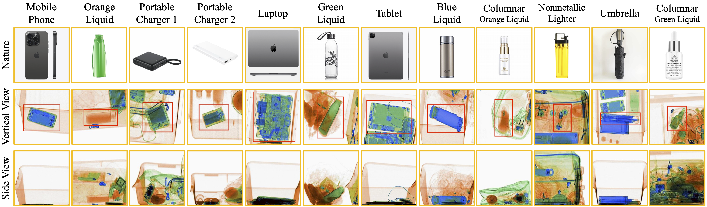

# Airport X-Ray Guard System: Sistem Deteksi Otomatis Ancaman Keamanan Bandara Berbasis YOLO

## Introduction
Sistem kecerdasan buatan yang dirancang untuk mengotomatisasi deteksi barang berbahaya pada pemindai X-ray bandara. Proyek ini menjawab tantangan human error dan kelelahan visual pada proses security screening manual.

## Dataset
Dataset yang digunakan dalam project ini  bisa diakses melalui
- LDXray Dataset : [kaggle](https://www.kaggle.com/datasets/yuzheguocs/LDXray)

> NOTE : Dataset ini secara otomatis akan terdownload saat menalankan `preprocess.py`

## Summary 

Dataset memiliki 12 kelas yang dapat ditampilkan dalam gambar berikut :


Dataset akan memiliki awalan struktur seperti berikut:

```bash
.
├── dataset
│   ├── test_A   # 36.849 gambar (.jpg) tampak atas
│   ├── test_B   # 36.849 gambar (.jpg) tampak samping
│   ├── train_A  # 110.148 gambar (.jpg) tampak atas
│   └── train_B  # 110.148 gambar (.jpg) tampak samping
├── test.json
└── train.json
```
Data annatation tersebut dibungkus dalam format json (`test.json` & `train.json`) yang isinya _(sampel : index 0)_ sebagai berikut:

```json
.json : [
    "annotations" : [
        {
            "id": 1,
            "image_id": 1,
            "category_id": 4,
            "segmentation": [[75,476,75,912,390,912,390,476]],
            "area": 137340,
            "bbox": [75,476,315,436],
            "iscrowd": 0
        },
        ...
        ],
    "categories" : [
        {
            "id": 1,
            "name": "Mobile_Phone",
            "supercategory": "Mobile_Phone"
        },
        ...
        ],
    "images" : [
        {
            "id": 1,
            "width": 440,
            "height": 1040,
            "file_name": "000000.jpg",
            "license": 1,
            "flickr_url": null,
            "coco_url": null,
            "date_captured": "2023-12"
        },
        ...
        ],
    "info" : [...]
    "licenses" : [...]
]
```

yang isinya dapat divisualisasikan dalam gambar berikut:


## Struktur Direktori Project

```bash
project
├── configs
│   └── yolo{vesion}{size}.yaml
├── data
│   ├── documents
│   ├── interim
│   ├── processed
│   └── raw
├── notebooks
│   ├── 1_eda.ipynb
│   ├── 2_1_preprocessing_train.ipynb
│   ├── 2_2_preprocessing_test.ipynb
│   └── 3_training.ipynb
└── outputs
    ├── models
    └── logs
```

## Code

### Prepare

Buat Virtual Environtment terlebih dahulu agar program berjalan dengan lancar

```Terminal
$ python3 -m venv .{nama_venv}
$ source .{nama_venv}/bin/activate
```

Lalu install library yang dibutuhkan project ini

```Terminal
$ pip install -r requirments.txt
```

### Pre-process

Jalankan preprocess ini untuk mendownload dataset dan mengolah dataset sesuai dengan format yang dibutuhkan YOLO

```Terminal
$ python3 src/preprocess.py
```

### Train

Dokumentasi lengkap untuk parameter pelatihan YOLO
https://docs.ultralytics.com/modes/train#musgd-optimizer

```python
model = YOLO("yolov8n.pt") # Bisa menggunakan bobot checkpoint jika training sebelumnya terputus
```
config :
- **data**    = Berisi data yaml, default: `(data=../configs/yolo11n.yaml)` 
- **epochs**  = Jumlah literasi pelatihan model
- **imgsz**   = Ukuran gambar yang akan di prosess, max: `(imgsz=640)`
- **batch**   = Ukuran batch atau bisa diatur mode otomatis `(batch=-1)`
- **device**  = Menentukan perangkat komputasi untuk pelatihan, GPU `(device=0)`, CPU `(device=cpu)`
- **project** = Lokasi hasil model disimpan
- **name**    = Nama training. Digunakan untuk menamai dub direktori project
- **patience**= Sistem early stoping jika pelatihan model tidak ada perkembangan
- **save**    = Menyimpan checkpoint bobot terakhir
- **workers** = Jumlah thread pekerja untuk prosess data

Jalankan perintah training

```Terminal
$ python3 src/train.py
```

atau

```Terminal
$ yolo task=detect mode=train model=yolo11n.pt data=../configs/yolo11n.yaml epochs=5 batch=16 workers=8 device=0 project=../outputs/models/ name=ldxray_yolo11n patience=5 save=True
```

> NOTE : Jika ingin melanjutkan checkpoint user tidak perlu melakukan configurasi lagi